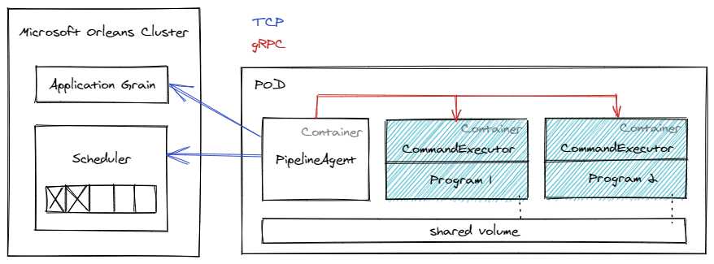

# Command executor
A service designed to execute commands inside its container. By default, it starts processes with parameters through the shell.



Command executor communicates with Pipeline Agent. An example of the commands sent by the Pipeline Agent:
```yaml
"commandLines": [
  "wget -O /mnt/pipe/2rb88.png https://i.stack.imgur.com/2rb88.png",
  "wget -O /mnt/pipe/text-photographed-eng.jpg https://www.imgonline.com.ua/examples/text-photographed-eng.jpg",
  "wget -O /mnt/pipe/Cleartype-vs-Standard-Antialiasing.gif https://upload.wikimedia.org/wikipedia/commons/b/b8/Cleartype-vs-Standard-Antialiasing.gif"
]
```

```yaml
"commandLines": [
  "for file in $(ls -v *.*) ; do tesseract $file {file%.*}.txt; done"
]
```

```yaml
"commandLines": [
  "mc mb buckets/5840e11b-2117-4036-a6e6-bcff03fbd3c9",
  "mc cp --recursive /mnt/pipe/ buckets/5840e11b-2117-4036-a6e6-bcff03fbd3c9",
  "rm -r /mnt/pipe/*"
]
```

A command executor layer must be added to each Container where it will execute commands. Example:
```Dockerfile
ARG IMAGE_TAG=latest
FROM docker.io/aryazanov/command-executor:${IMAGE_TAG} AS command-executor

FROM clearlinux/tesseract-ocr:4.1.1
WORKDIR /
COPY --from=command-executor /bin/command-executor /bin/command-executor

USER 65535:65535
ENTRYPOINT ["command-executor"]
```
